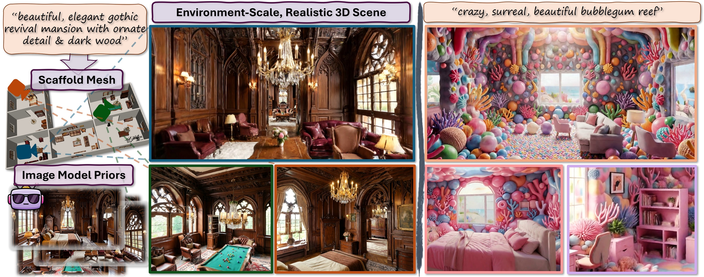

# WorldMesh
Official implementation of *WorldMesh: Generating Navigable Multi-Room 3D Scenes via Mesh-Conditioned Image Diffusion*. Code coming soon.

WorldMesh generates large, navigable multi-room 3D scenes from text prompts by first constructing an explicit mesh scaffold for geometric consistency, then conditioning image diffusion on that scaffold to produce photorealistic, 3D-consistent appearance across arbitrarily many rooms.

[[arXiv]] [[Project Page](https://mschneider456.github.io/world-mesh/)] [[Video](https://youtu.be/MKMEbPT38-s)]



If you find WorldMesh useful, please cite:
```
@misc{TBD}
```
